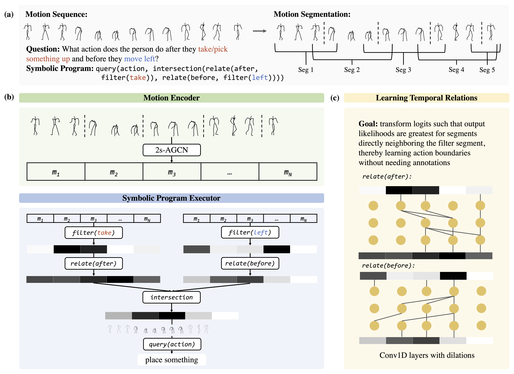

## NSPose

<div>
  
</div>

### Setup

Install [Jacinle](https://github.com/vacancy/Jacinle).
```bash
  git clone https://github.com/vacancy/Jacinle --recursive
  export PATH=<path_to_jacinle>/bin:$PATH
```

### Evaluation

To evaluate NSPose:

```bash

  data_dir = <path_to/TBD>

  jac-crun 0 nspose/trainval.py \
  --desc nspose/desc_nspose.py \
  --data-dir $data_dir \
  --batch-size 4 \
  --temporal_operator conv1d \
  --no_gt_segments \
  --load $load_path \
  --evaluate
```

Weights for our trained NSPose model can be found at TBD and loaded into `load_path`.


### Training

To train NSPose:

```bash

  data_dir=<path_to/TBD>

  jac-crun 0 nspose/trainval.py \
  --desc nspose/desc_nspose.py \
  --data-dir $data_dir \
  --batch-size 4 \
  --temporal_operator conv1d \
  --no_gt_segments
```

### Acknowledgements

Our codebase is built on top of [NSCL](https://github.com/vacancy/NSCL-PyTorch-Release). Please feel free to email us if any problems arise.