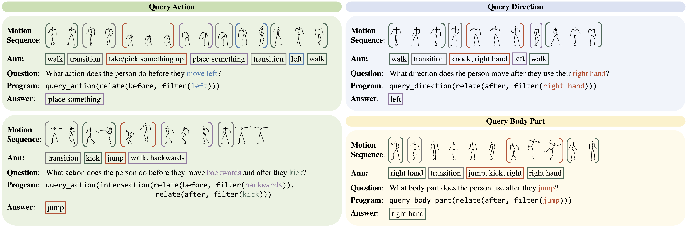

<p align="center">

  <h1 align="center">Motion Question Answering via Modular Motion Programs
    <a href='https://arxiv.org/abs/2305.08953'>
    
    </a>
    <a href='https://web.stanford.edu/~markendo/projects/human_motion_qa' style='padding-left: 0.5rem;'>
    
  </h1>
  <h3 align="center">
    <a href="https://markendo.github.io/"><strong>Mark Endo*</strong></a>
    ,
    <a href="http://web.stanford.edu/~joycj/"><strong>Joy Hsu*</strong></a>
    ,
    <a href="https://lijiaman.github.io/"><strong>Jiaman Li</strong></a>
    ,
    <a href="https://jiajunwu.com/"><strong>Jiajun Wu</strong></a>
  </h3>
  <h3 align="center">In International Conference on Machine Learning (ICML) 2023</h3>
  <div align="center">
  </div>
</p>

<div>
  
</div>

We split our repository into two sections, one for our proposed [`BABEL-QA`](BABEL-QA/) dataset and the other for our [`NSPose`](NSPose/) method.

## Setup

Run the following commands to install necessary dependencies.

```bash
  conda create -n human_motion_qa python=3.7.11
  conda activate human_motion_qa
  pip install -r requirements.txt
```

## BABEL-QA

Due to data distribution policies of AMASS and BABEL, we are not allowed to distribute the dataset directly. We provide data generation code in [`BABEL-QA/`](BABEL-QA/).


## NSPose

Please see [`NSPose/`](NSPose/) for more details. 
